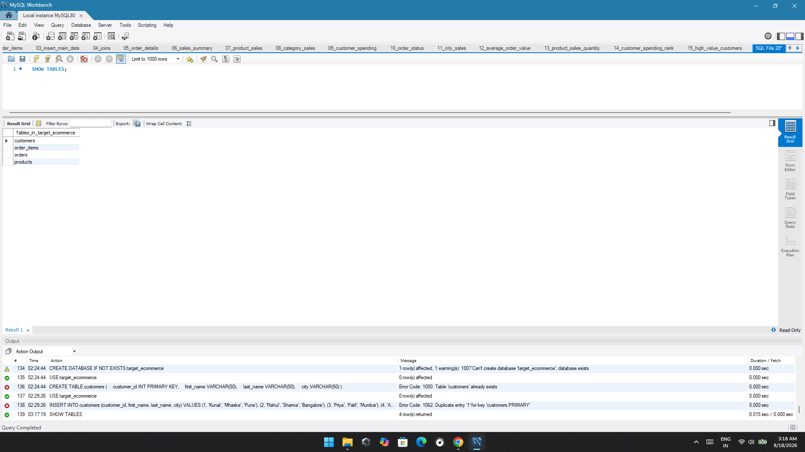
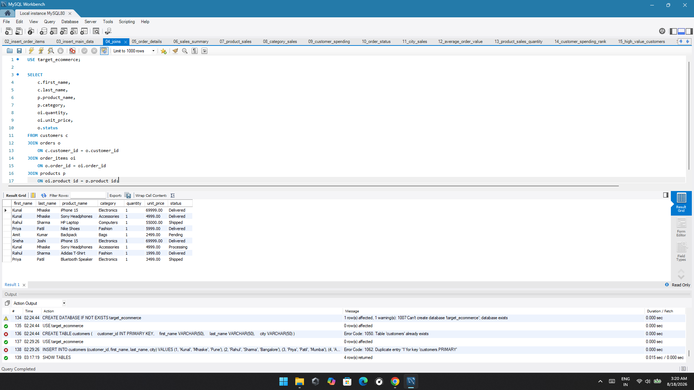
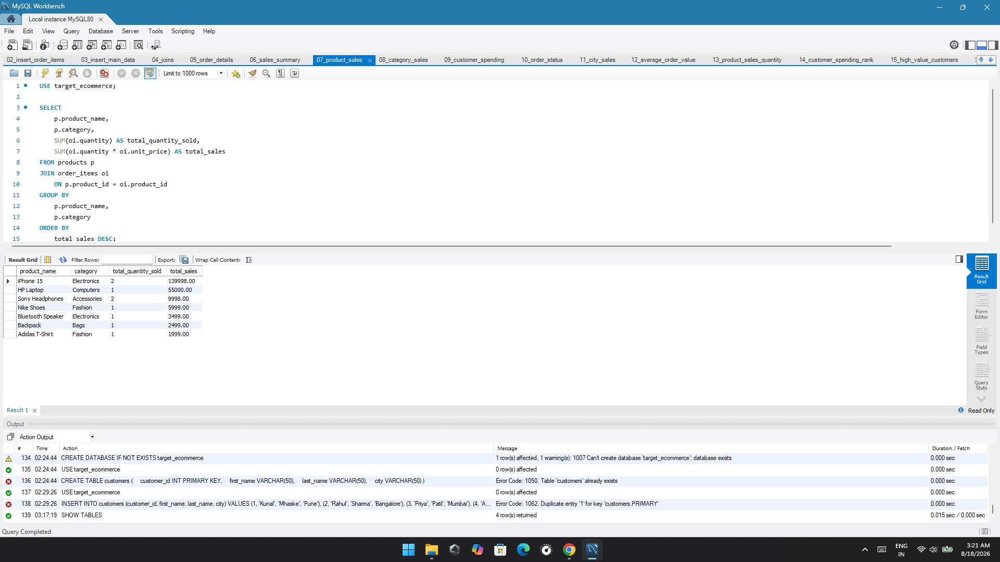
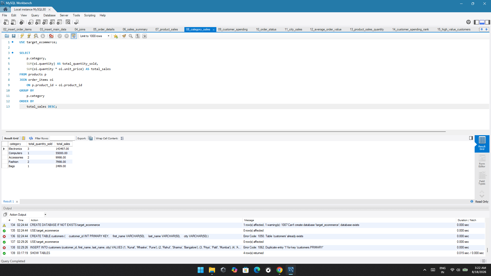
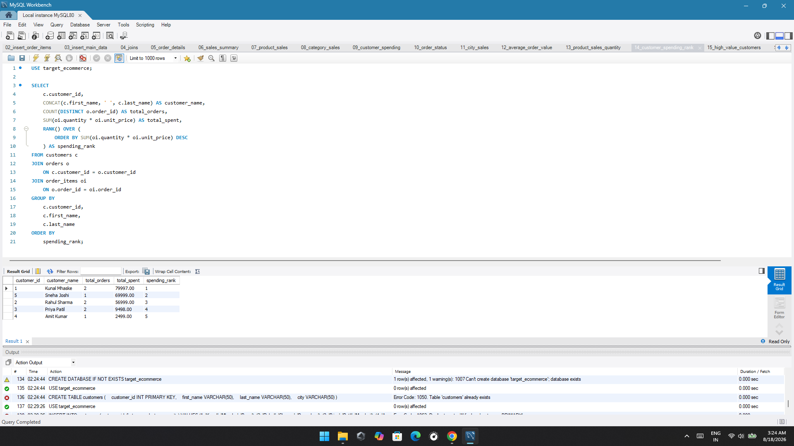
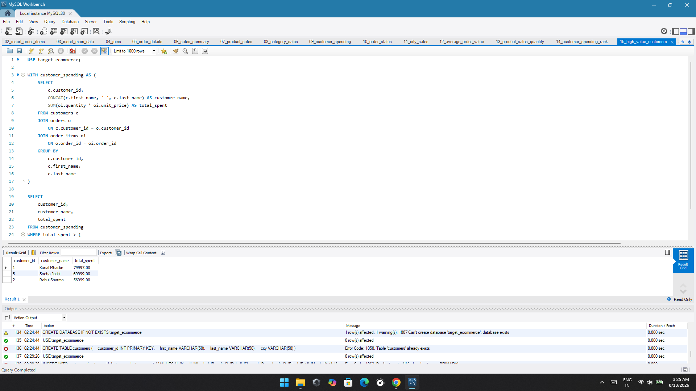

# E-Commerce SQL Analysis

## 📌 Overview

A SQL-based e-commerce data analysis project built using **MySQL**.

This project analyzes customers, products, orders, sales, categories, cities, and customer spending to generate useful business insights.

## 🛠️ Tools & Technologies

- MySQL
- MySQL Workbench
- SQL
- GitHub

## 🗄️ Database Schema

The database contains four main tables:

- `customers` – Customer information
- `products` – Product information and pricing
- `orders` – Order details and status
- `order_items` – Products, quantities, and prices within each order

## 📊 SQL Analysis Results

### 1. Database Tables

### 2. JOIN Analysis

### 3. Product Sales

### 4. Category Sales

### 5. Customer Spending Ranking

### 6. High-Value Customers

## 🎯 Key SQL Concepts

- SELECT
- WHERE
- GROUP BY
- ORDER BY
- COUNT()
- SUM()
- ROUND()
- DISTINCT
- JOIN
- Common Table Expressions (CTEs)
- Window Functions
- RANK()
- Foreign Keys

## 🎯 Conclusion

This project demonstrates how SQL and MySQL can be used to analyze e-commerce data and generate meaningful business insights.

The analysis covers customer spending, product performance, category sales, city-level sales, order status, and average order value.
## 🎯 Conclusion

This project demonstrates how SQL and MySQL can be used to analyze e-commerce data and generate meaningful business insights.

The analysis covers customer spending, product performance, category sales, city-level sales, order status, and average order value.

The project strengthened practical skills in SQL querying, data aggregation, joins, CTEs, and window functions.
## 💡 Key Business Insights

- Identified the highest-spending customers using aggregation and ranking.
- Analyzed product-level sales performance using SUM() and GROUP BY.
- Compared sales performance across product categories.
- Analyzed sales by city to identify high-performing locations.
- Examined order status to understand completed and pending orders.
- Calculated average order value to understand customer purchasing behavior.
